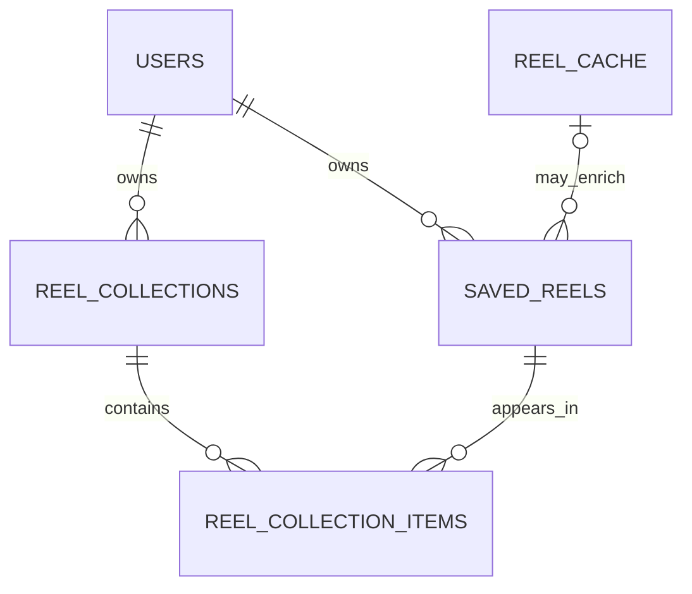

# Saved Reels Schema Foundation — Design

> Date: 2026-07-18
> Scope: Supabase schema Slice 1 only
> Status: implemented and locally verified on `zh`
> Product source: `docs/UPDATE.md` sections 3, 4, 6.4, 6.5, and 14

## 1. Outcome

Create the permanent, user-owned Saved Reels library that exists before analysis,
country organization, or trip generation.

This slice must support:

- saving a normalized Reel URL without calling Apify;
- one Saved Reel appearing in several flat custom collections;
- removing one collection membership without deleting the Saved Reel;
- an explicit Delete everywhere action that removes only the user's copy;
- linking to a shared global `reel_cache` result when one exists;
- atomic duplicate handling for repeated Save actions;
- owner-only access enforced by Supabase RLS.

It does not add Reel-to-place mentions, country trays, city grouping, category tags,
trip changes, or hotel changes.

## 2. Existing-schema mismatch

The current schema is trip-first:

```text
reel_cache -> trip_inspiration_items -> trips
```

`trip_inspiration_items` cannot be the permanent Saved Reels library because every row
requires a `trip_id`. A user must be able to save a Reel today and create no trip at all.

`reel_cache` also cannot represent ownership. It is a shared service-role cache keyed by
normalized URL and may be reused by several users. Deleting one user's Saved Reel must
never delete that shared cache row.

## 3. Proposed relationships



The same `saved_reels.id` may have several collection-item rows. No Reel record or
extraction result is duplicated when the user adds it to another collection.

## 4. Table contracts

### 4.1 `public.saved_reels`

One row means one user has saved one normalized Reel URL.

| Column | Type | Rules |
|---|---|---|
| `id` | `uuid` | PK, `gen_random_uuid()`; follows the existing public-ID contract |
| `user_id` | `uuid` | Required FK to `public.users(id)`, cascade on user deletion |
| `normalized_url` | `text` | Required canonical source identity |
| `source_platform` | `text` | Required, default `instagram`; checked against `instagram`, `tiktok`, `manual` for parity with `reel_cache` |
| `reel_cache_id` | `uuid` | Nullable FK to shared `public.reel_cache(id)`, `ON DELETE SET NULL` |
| `analysis_status` | `text` | Required state; see allowed values below |
| `personal_label` | `text` | Nullable user label, maximum 120 characters |
| `retry_after` | `timestamptz` | Nullable cooldown after a retryable source failure |
| `analyzed_at` | `timestamptz` | Nullable completion timestamp |
| `created_at` | `timestamptz` | Required, default `now()`; this is the user-visible saved time |
| `updated_at` | `timestamptz` | Required, default `now()`, maintained by `private.set_updated_at()` |

Allowed `analysis_status` values:

- `not_analyzed`
- `queued`
- `processing`
- `organized`
- `location_not_found`
- `failed`

Constraints:

- `UNIQUE (user_id, normalized_url)` is the duplicate-save authority.
- `normalized_url` must be non-blank.
- `personal_label` is null or non-blank and no longer than 120 characters.
- `analyzed_at` is required only for terminal analyzed states `organized` and
  `location_not_found`; it remains optional for `failed` because a source may fail before
  analysis begins.
- Add `UNIQUE (user_id, id)` to support same-owner composite foreign keys from collection
  membership rows.

The backend save path uses one atomic `INSERT ... ON CONFLICT (user_id, normalized_url)`.
It must not perform a SELECT-then-INSERT sequence. On conflict it may attach a newly found
`reel_cache_id`, but it must not overwrite the user's `personal_label`.

### 4.2 `public.reel_collections`

One row means one user-created, flat Saved Reels folder.

| Column | Type | Rules |
|---|---|---|
| `id` | `uuid` | PK, `gen_random_uuid()` |
| `user_id` | `uuid` | Required FK to `public.users(id)`, cascade on user deletion |
| `name` | `text` | Required trimmed display name, 1-80 characters |
| `sort_order` | `integer` | Required, default `0`, non-negative |
| `created_at` | `timestamptz` | Required, default `now()` |
| `updated_at` | `timestamptz` | Required, default `now()`, maintained by trigger |

Constraints:

- A case-insensitive unique index on `(user_id, lower(btrim(name)))` prevents visually
  duplicate folder names for one user.
- Add `UNIQUE (user_id, id)` for same-owner membership foreign keys.
- Collections are flat. There is no `parent_collection_id` in the browser beta.

### 4.3 `public.reel_collection_items`

One row means one Saved Reel belongs to one custom collection.

| Column | Type | Rules |
|---|---|---|
| `user_id` | `uuid` | Required; makes ownership and RLS checks direct and indexed |
| `collection_id` | `uuid` | Required |
| `saved_reel_id` | `uuid` | Required |
| `created_at` | `timestamptz` | Required, default `now()` |

Constraints:

- Primary key `(collection_id, saved_reel_id)` prevents duplicate membership.
- Composite FK `(user_id, collection_id)` references
  `reel_collections(user_id, id) ON DELETE CASCADE`.
- Composite FK `(user_id, saved_reel_id)` references
  `saved_reels(user_id, id) ON DELETE CASCADE`.
- The composite foreign keys make it impossible to place user B's Reel into user A's
  collection, even if application code is wrong.

There is intentionally no surrogate `id` for this pure junction row.

## 5. Indexes

Create only indexes backed by known access patterns:

```sql
-- Saved Reels library, newest first and cursor-stable.
create index saved_reels_user_created_id_idx
  on public.saved_reels (user_id, created_at desc, id);

-- Temporary Organize Reels selection by state.
create index saved_reels_user_status_created_id_idx
  on public.saved_reels (user_id, analysis_status, created_at, id);

-- Cache attachment and FK delete/update checks.
create index saved_reels_reel_cache_id_idx
  on public.saved_reels (reel_cache_id)
  where reel_cache_id is not null;

-- Ordered collection list.
create index reel_collections_user_sort_idx
  on public.reel_collections (user_id, sort_order, created_at, id);

-- Both directions of the collection membership relation and both composite FKs.
create index reel_collection_items_user_collection_idx
  on public.reel_collection_items (user_id, collection_id);

create index reel_collection_items_user_saved_reel_idx
  on public.reel_collection_items (user_id, saved_reel_id);
```

The uniqueness constraints and primary keys create their own supporting indexes and must
not be duplicated by separate indexes with the same leading columns.

## 6. Permissions and RLS

Enable RLS on all three tables. Every policy wraps `auth.uid()` in a scalar `SELECT` so it
is evaluated once per statement.

### `saved_reels`

- Authenticated users may `SELECT` and `DELETE` their own rows.
- Authenticated users may update only the `personal_label` column on their own rows.
- Authenticated clients may not insert rows or change `analysis_status`, `reel_cache_id`,
  cooldowns, or analysis timestamps. Those writes go through the authenticated backend,
  which validates and normalizes the URL before using the service role.
- The service role has full access.

### `reel_collections`

- Authenticated users may select, insert, update, and delete their own rows.
- Both `USING` and `WITH CHECK` enforce `user_id = (select auth.uid())` for updates.
- The service role has full access.

### `reel_collection_items`

- Authenticated users may select, insert, and delete their own membership rows.
- Updates are unnecessary. Moving a Reel is an insert plus a delete, and adding it to
  another folder is just an insert.
- `WITH CHECK` enforces `user_id = (select auth.uid())`; the composite foreign keys prove
  that both referenced rows have the same owner.
- The service role has full access.

No authenticated access to `reel_cache.raw_payload` or transcripts is added in this
slice. A later source-card contract must expose only approved display fields.

## 7. Delete semantics

- **Remove from folder:** delete one `reel_collection_items` row.
- **Delete folder:** cascade-delete only that folder's membership rows. Saved Reels remain.
- **Delete everywhere:** delete the user's `saved_reels` row. All of that user's collection
  memberships for the Reel cascade away.
- **Shared cache:** never cascade from `saved_reels` to `reel_cache`. The global cache and
  other users' Saved Reels remain.
- **Delete user:** cascade all of that user's Saved Reels, collections, and memberships.

## 8. Database test contract

Add one pgTAP test file for this migration. It must prove:

1. all three tables, expected columns, checks, foreign keys, and indexes exist;
2. the same user cannot create two Saved Reels with the same normalized URL;
3. different users may save the same normalized URL and share one `reel_cache` row;
4. one Saved Reel may belong to several collections;
5. duplicate membership is rejected;
6. a cross-user collection membership is rejected by the composite foreign key;
7. user A cannot read, rename, delete, or organize user B's data;
8. authenticated clients cannot insert Saved Reels directly or mutate backend-owned
   analysis fields;
9. deleting one membership leaves the Saved Reel and other memberships intact;
10. deleting a collection leaves Saved Reels intact;
11. Delete everywhere removes the user's memberships but preserves `reel_cache` and
    another user's Saved Reel;
12. the service role path can atomically upsert a duplicate URL without overwriting
    `personal_label`.

Tests must run after a local `supabase db reset`, followed by `supabase test db` and
`supabase db lint`. Remote migration is out of scope until those checks pass.

## 9. Schema parity required during implementation

The eventual implementation plan must update these contracts in the same reviewed unit:

- forward-only Supabase migration;
- pgTAP RLS/constraint tests;
- generated or handwritten TypeScript row types for `SavedReel`, `ReelCollection`, and
  `ReelCollectionItem`;
- backend request/persistence types for normalized capture and atomic upsert.

No frontend screen or extraction pipeline change belongs in the schema migration task.

## 10. Deferred slices

- Slice 2: reusable `reel_place_mentions` plus safe source-card read contract.
- Slice 3: canonical country/city grounding, user places, and country trays.
- Slice 4: bridge Saved Reels and selected places into trips.
- Slice 5: one grounded, ranked hotel recommendation.

These are dependencies, not work hidden inside Slice 1.

## 11. Implementation receipt

Implemented in the reviewed Saved Reels schema-foundation slice:

- forward-only migration `20260718120000_saved_reels_foundation.sql`;
- pgTAP contract coverage in `supabase/tests/006_saved_reels_foundation.sql`;
- authenticated `POST /saved-reels` with the request body `{ "url": string }` and
  response `{ "saved_reel": SavedReel }`;
- Pydantic and TypeScript Saved Reel, collection, and membership contracts; and
- atomic service-role capture through `capture_saved_reel` after existing Instagram URL
  normalization.

The verified deletion contract is unchanged from this design: removing a collection item
removes only that membership, deleting a collection leaves Saved Reels intact, deleting a
Saved Reel removes only that user's memberships, and deleting a shared cache row sets the
Saved Reel cache reference to null. Other users' Saved Reels and the shared cache are not
deleted by a user's Delete everywhere action.

Local verification completed on 2026-07-18:

```text
supabase db reset                                      PASS
supabase test db                                       PASS (218 tests)
supabase db lint                                       PASS (no schema errors)
uv run pytest -v --basetemp .pytest-tmp-saved-reels-task6-full
                                                        PASS (471 passed, 7 skipped)
RUN_DB_INTEGRATION=1 uv run pytest test_saved_reels_integration.py -v
  --basetemp .pytest-tmp-saved-reels-task6-integration PASS (1 passed)
npm run typecheck                                      PASS
npm test                                               PASS (37 files, 142 tests)
npm run build                                          PASS (controller rerun; Next.js 15.5.19,
                                                        10/10 static pages)
```

The first sandboxed build retry could not download Google-hosted `next/font` assets due to
an `EACCES` network restriction. The controller reran the unchanged build with approved
network-capable permission; it passed with only the existing Supabase Edge Runtime warning.
The repository-local pytest directories are a Windows-only temporary-directory workaround
for an otherwise denied default pytest temp location; no test was waived.

Manual audit confirmed that client bodies cannot supply ownership or backend state, the
route authenticates before opening its Supabase client, frontend code receives no
service-role credential or raw `reel_cache` content, authenticated users cannot insert
Saved Reels directly, the RPC execute grant is service-role-only, conflicts preserve
personal and analysis fields, composite foreign keys reject cross-owner membership, and
the capture path has no Apify, agent, extraction, quota, or trip-generation work. The
migration is new and forward-only; no existing migration changed.

Remote migration and all Saved Reels UI, country/city, trip, and hotel work remain
deferred.
